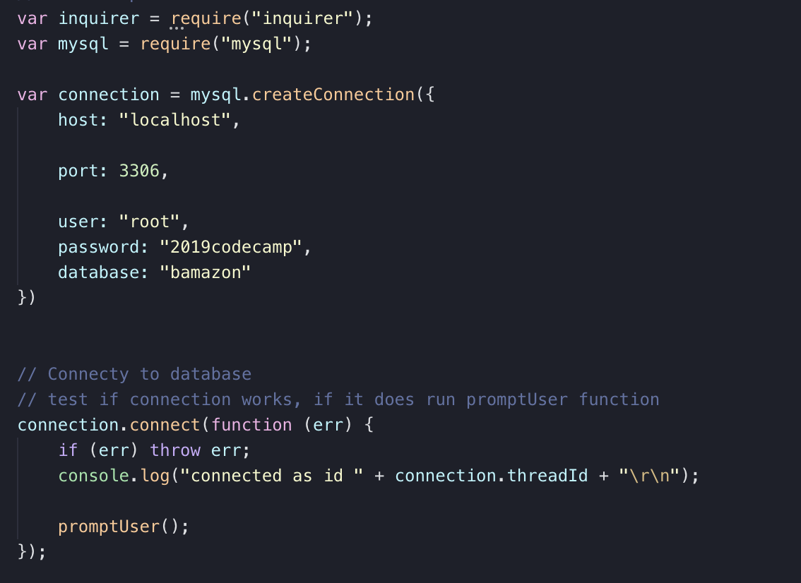
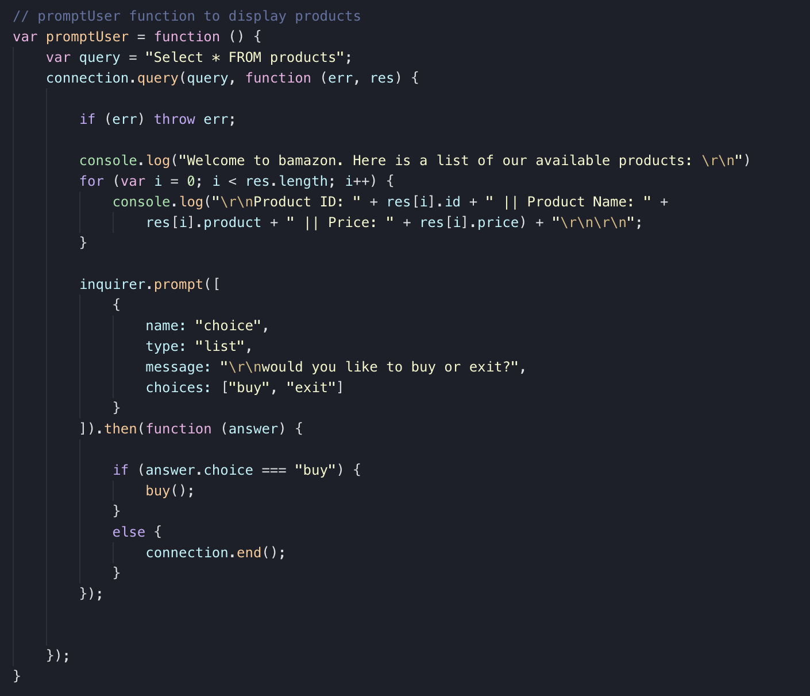
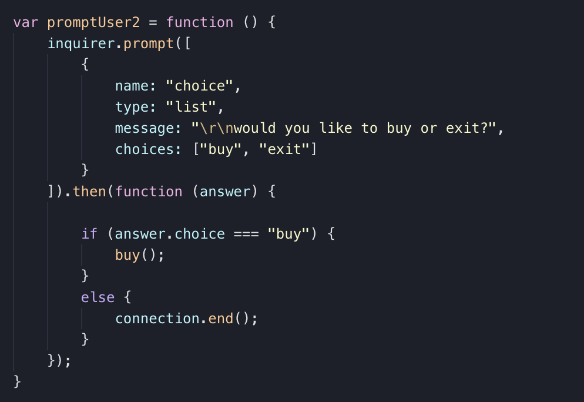
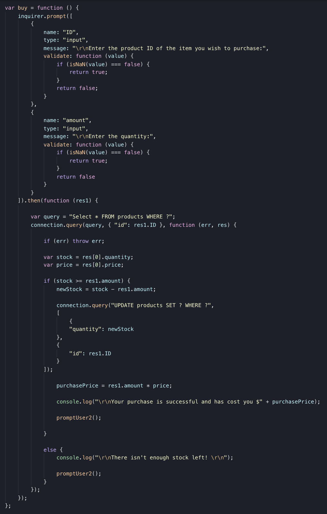

# bamazon
bamazon is a CLI storefront that utilizes MySQL and MySQL Workbench to create a database and Node.js to call and manipulate the database.

## Demo

## How-To
- Clone my repo. Then in your command line, `npm install inquirer` and `npm install mysql`. Open file `bamazonSeeds.sql`, copy the commands, and paste into MySQL Workbench. 
- In your command line, enter `node bamazonCustomer.js`
- Follow the prompts. Watch as the quantities in the database change!

## Connect
First, we require the npm packages we will be using in the app. We connect to our database and test if the connection is running. If it is, we call the function `promptUser()`.

## Initial prompt
The function `promptUser()` will call a list of all of the products in our database. Next, we use inquirer to ask whether or not the user would like to make a purchase. If the user decides to make a purchase, we will call the function `buy()`. If not, we will end the connection and close the app. 

## Second prompt
`promptUser2()` is a shortened version of `promptUser()`. It does not call items from the database and instead only gives user the option to purchase or exit. It is called in `buy()` and during any purchase issues (namely the event that a user attempts to purchase a larger than available quantity).

## Purchase prompt
Here, we are prompted via inquirer to enter the ID of the product we wish to purchase as well as the quantity. Then, the function checks if the quantity we wish to purchase is available in stock. If it is available, the purchase goes through: the quantity in our database of the product we purchased diminishes and a message stating our purchase price, calculated by multiplying quantity by price, appears. If not, we are sent a message stating there isn't enough product in stock, and we are given the option to buy or exit again. 
